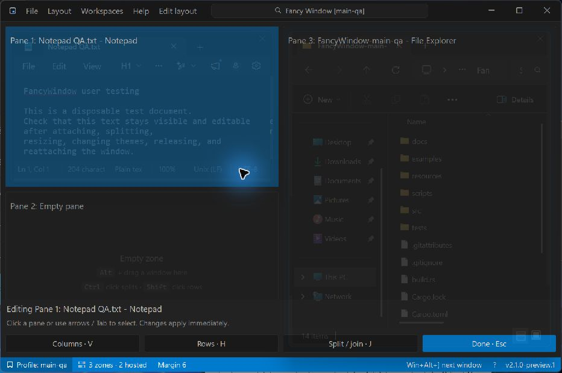
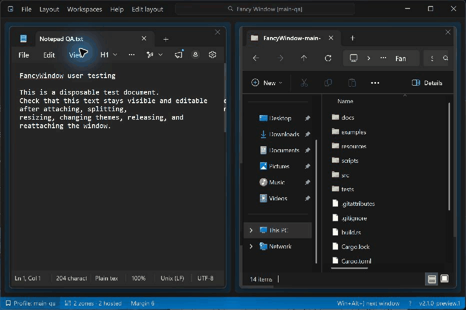
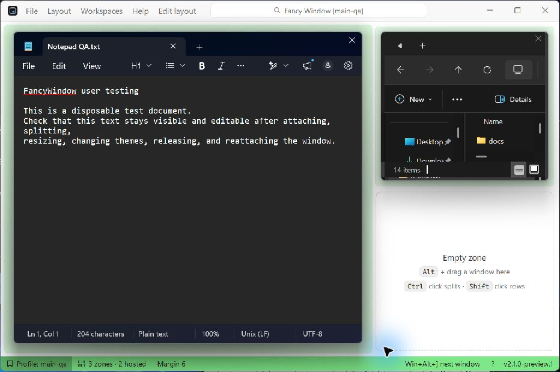
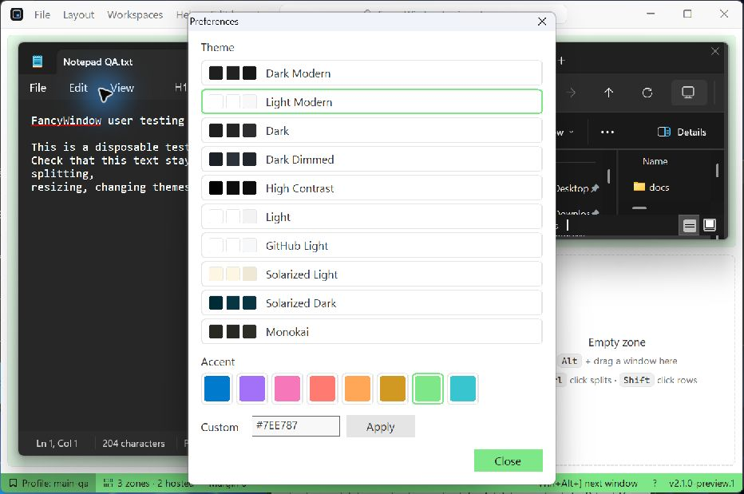
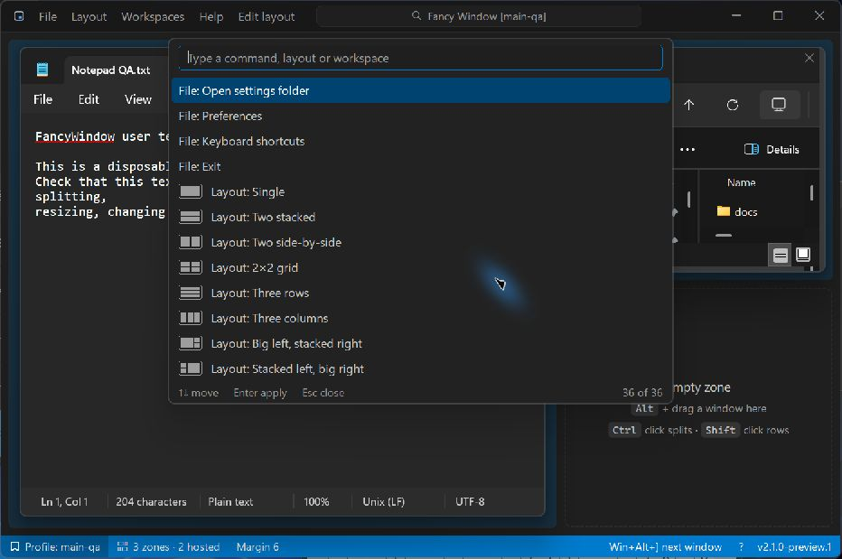

# Fancy Window

Keep your coding agents visible and your hands on the keyboard. Fancy Window
organises separate terminal windows into one resizable workspace on Windows 10/11:
two Codex CLI sessions, two Claude Code sessions, or whatever tools your project needs.

Switch to the next terminal with **Win+Alt+]**, go back with **Win+Alt+[**, and carry
on typing. The background tint follows focus, so you can see exactly which session
will receive your next command. No hunting through overlapping terminal windows.


These screenshots and controls show **2.1.0-preview.1 on main**. The latest packaged
release is [2.0.0](https://github.com/DevNickThomas/FancyWindow/releases/tag/v2.0.0),
which predates this interface. Build main to try the preview.

## Get started

Download a zip from [Releases](https://github.com/DevNickThomas/FancyWindow/releases),
extract it to a writable folder, and run `FancyWindow.exe`. It is a portable Rust
application, with settings stored alongside the executable.

1. Choose **Two side-by-side** or **2×2 grid** from **Layout**.
2. Hold **Alt** while dragging an application's title bar into a pane. Release the
   mouse while Alt is still held. The window fits that pane.
3. Drag the gaps between panes to resize them.
4. To release a hosted window, **Alt+drag** its title bar to the place you want it.
   A normal drag keeps it attached and returns it to its pane.
5. Closing Fancy Window releases hosted windows without closing their apps.

The executable is currently unsigned. Windows may show a SmartScreen warning or
block it with Smart App Control. Release signing is tracked in
[#6](https://github.com/DevNickThomas/FancyWindow/issues/6).

## Split an occupied pane

You do not need to find an exposed patch of background around the hosted app.

1. Use the app you want to split, then choose **Edit layout** in the toolbar or
   press **Ctrl+Alt+E**. Its pane is selected automatically.
2. Click another pane, use the **arrow keys**, or use **Tab / Shift+Tab** to change
   the target. A tinted background and the pane's app name identify it.
3. Press **V** for side-by-side columns or **H** for stacked rows. Repeat inside
   an existing split to build a nested layout.
4. Press **J** or right-click the selected pane for split and join options.
   Joins are available where there is a compatible neighbouring pane.
5. Press **Enter**, **Esc**, or **Ctrl+Alt+E** again to finish and return focus to
   the selected app. Changes apply immediately; Esc does not undo them.



<details>
<summary>Watch the layout-editing demonstration</summary>



A short sequence of captures from the running preview. The static screenshot
above shows the same controls without animation.

</details>

Panes have **no extra Fancy Window header by default**. The hosted application's
own title bar remains. **Layout > Show zone headers** enables optional titles,
focus controls and release buttons; existing saved preferences are respected.

On exposed pane backgrounds, **Ctrl+click** splits into columns, **Shift+click**
splits into rows, and **Ctrl+right-click** opens the pane menu. **Right-click a
splitter** to merge the panes beside it.

## Focus, themes and colours

Click a hosted app to use it, or cycle between apps with **Win+Alt+] / Win+Alt+[**.
The focused pane gets a stronger background tint, allowing the app to retain its
native corners without an extra focus outline.

Open **File > Preferences** to choose one of ten themes, an accent swatch, or a
custom `#RRGGBB` colour. The accent controls the focus tint and status bar. Changes
apply immediately. Each hosted app keeps its own theme.



<details>
<summary>Theme and accent preferences</summary>



</details>

## Workspaces and command palette

### Name your windows by project or agent

Use **File > New window** to create another independent Fancy Window and give it a
name, such as **Claude · Project A** or **Codex · Project B**. The name appears first
in the title bar and in Alt+Tab, and stays there when you split or resize panes.
**File > Rename window** changes it without moving its settings or replacing its layout.

**File > Open window** reopens a saved named window with its last layout, theme and
preferences. If that window is already running, it is brought forward. Separate
windows use separate settings files, including when their display names match.
New windows open on the next monitor when available, or cascade on the same screen.
Keep their canvases separate when attaching windows; overlapping-instance drops
still have the limitation tracked in [issue #3](https://github.com/DevNickThomas/FancyWindow/issues/3).

Focus cycling continues across Fancy Window instances, so project groups can live
on different monitors without needing the mouse to move between their terminals.

### Save and reuse pane layouts

Use **Workspaces > Save current as** to name a layout. Pick its name in that menu
to load it, or use **Workspaces > Set hotkey** to assign a shortcut. Workspaces save
pane arrangements, not application sessions: they do not launch apps or restore
documents. Loading a layout moves already hosted windows into its panes in reading
order; windows that no longer fit are released.

**Workspaces > Rename** changes a saved layout's name while keeping its geometry and
shortcut. **Workspaces > Open in new window** starts a separate named window from
that saved layout. It does not move or duplicate the current window's running agents.

### Manage the workspace from the keyboard

When Fancy Window itself has focus, **Alt+F / Alt+W / Alt+L / Alt+H** open File,
Workspaces, Layout and Help. Use arrows and Enter to choose a command. Global
shortcuts such as **Ctrl+Alt+E** and **Win+Alt+Space** work while a hosted app has focus.

Click the search box in the title bar, choose **File > Command palette**, or press
**Win+Alt+Space**. Type to filter layouts, saved workspaces and commands, use the
arrow keys to select, then press **Enter**. **Esc** closes the palette.



The status bar is interactive:

| Click | Result |
| --- | --- |
| Workspace/profile name | Open Workspaces |
| Zone/window count | Open Layout |
| Margin | Increase by 2; right-click to decrease |
| Held at the back | Bring the host forward |
| **?** | Open keyboard shortcuts |

**Layout > 2×2 grid** keeps hosted apps when applying that preset. **Reset to 2×2**
currently releases all hosted windows as well as resetting the layout.

## Keyboard shortcuts

| Default chord | Action |
| --- | --- |
| **Ctrl+Alt+E** | Open/finish contextual layout editing |
| **Alt+F / Alt+W / Alt+L / Alt+H** | Open a menu when Fancy Window has focus |
| **Win+Alt+] / Win+Alt+[** | Focus next/previous hosted window, across instances |
| **Win+Alt+PageDown** | Send Fancy Window behind other windows and keep it there |
| **Win+Alt+PageUp** | Bring Fancy Window forward |
| **Win+Alt+= / Win+Alt+-** | Increase/decrease the hosted-window margin |
| **Win+Alt+Home** | Reset to 2×2 and release hosted windows |
| **Win+Alt+Space** | Open the command palette |

In **File > Keyboard shortcuts**, choose **Change** beside a command and press a
chord. The dialog reports whether it is available, already assigned, or held by
another application. Only an available chord can be saved. **Clear** removes a
binding; **Reset to defaults** restores the command shortcuts. Custom bindings
are retained between launches.

## Profiles and settings

Run `FancyWindow.exe --profile work` for a separate set of saved layouts and
preferences. Multiple instances can have different profiles.

Names and saved layouts live beside the executable, so keep using the same portable
folder to reopen them. See the [named-window QA record](docs/qa/2026-10-02-named-windows.md)
for the tested create, rename and reopen workflows.

| File beside the executable | Purpose |
| --- | --- |
| `settings.json` and `settings.json.bak` | Default profile and backup |
| `settings-work.json` | Settings for the `work` profile |
| `crash.log` / `crash-work.log` | Diagnostic log if that instance panics |

**File > Open settings folder** opens this location in File Explorer.

## Build the preview

Install Rust with the `x86_64-pc-windows-gnu` toolchain and MinGW-w64. Put MinGW's
`bin` directory on `PATH` at a location **without spaces**, such as
`C:\mingw64\bin` (gcc and windres do not handle spaced paths reliably).

```powershell
cargo test --locked
cargo build --release --locked
.\target\release\fancy-window.exe --profile preview
# Package after closing the preview:
.\scripts\package.ps1
```

Packaging writes a zip and `.sha256` to `dist`. After changing dependencies, run
`scripts/third-party-notices.sh` to refresh `THIRD-PARTY-NOTICES.txt`.

`scripts\test-windows.ps1` opens disposable windows for testing Alt+drag.
`scripts\ui-test\` contains the UI stories and their run instructions.
[GitHub Issues](https://github.com/DevNickThomas/FancyWindow/issues) tracks bugs
and remaining UX work. [Media notes](docs/screenshots/README.md) describe these
screenshots and the animation.

## Current compatibility notes

The preview has been exercised with Notepad, File Explorer, Calculator and
Character Map. Occupied nested splits, contextual selection, joins and theme changes
work with Notepad and Explorer. Calculator displayed a blank pane while hosted,
and some native windows showed clipping or stale frame strips after resizing.
These findings remain open; see the [QA record](docs/qa/2026-10-02.md) and
[issue #7](https://github.com/DevNickThomas/FancyWindow/issues/7).

Allow enough room for each application's native controls. The exact Alt+drag
gesture, default Windows-key shortcuts and mixed-DPI behaviour still need the
manual checks listed in the QA record.

## Architecture

Each action follows `Win32 event → Msg → update(state, msg) → effects → repaint`.

| Folder | Responsibility |
| --- | --- |
| `src/model/` | Layout tree, geometry, settings and shortcut chords |
| `src/app/` | Application state, messages, updates and menus |
| `src/view/` | Themes and GDI painting |
| `src/platform/` | Windows hosting, input, dialogs and persistence |

The model and app layers are pure and unit tested. The
[design notes](docs/design/README.md) preserve the original mockups and later decisions.

## Licence

MIT: see [LICENSE](LICENSE). Dependency licences are in
[THIRD-PARTY-NOTICES.txt](THIRD-PARTY-NOTICES.txt).
