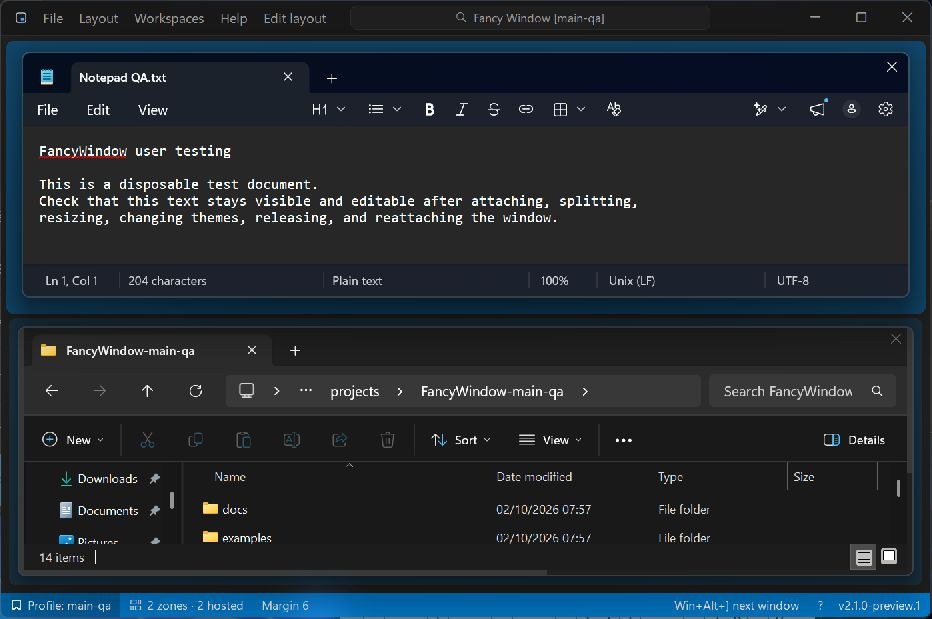

# Fancy Window

A tiny tiling host for Windows. Drop other applications' windows into
resizable zones, save named layouts, switch between them with hotkeys.



A single ~2.5 MB exe written in Rust, with nothing to install (Windows 10/11).

## Install

Download the zip from Releases, unzip anywhere and run `FancyWindow.exe`. The exe
is not code-signed, so the first time Windows may say "Windows protected your
PC": choose **More info > Run anyway**. Check the download against the
`.sha256` file if you like.

## Quick start

1. Run `FancyWindow.exe` (or `FancyWindow.exe --profile work` for a separate
   copy with its own `settings-work.json`).
2. **Alt+drag** any window into a zone. Drag it out with Alt to let it go.
3. Drag splitters to resize; **right-click a splitter** to merge.
4. Choose **Edit layout** in the toolbar, or press **Ctrl+Alt+E**. The last-used
   hosted app's pane is selected. Click another pane or use **arrows / Tab / Shift+Tab**
   to change the target. **V** splits into columns, **H** into rows, and **J** opens
   split/join options. **Esc** or **Enter** finishes and returns focus to the selected
   app. Changes apply immediately. The temporary overlay works over occupied panes.
5. Panes have no extra title header by default. **Layout > Show zone headers** can
   enable the optional title/focus/release controls; existing saved preferences are
   respected. **Ctrl+click**, **Shift+click**, and **Ctrl+right-click** still work on
   exposed zone surfaces for splitting and opening the zone menu.

## Keyboard shortcuts

Defaults below. Every hotkey can be changed or cleared in **File > Keyboard
shortcuts** (also under Help, and the **?** in the status bar): press **Change**,
then try key combinations. Each one is checked as you press it: **Available**,
**Already used for** another command, or **In use by another application**
(Windows would never deliver it). Only an available chord can be saved.

| Chord | Action |
| --- | --- |
| `Ctrl+Alt+E` | Edit layout, starting from the last-used hosted app |
| `Win+Alt+PageDown` | Send Fancy Window behind everything (stays back while you attach) |
| `Win+Alt+PageUp` | Bring it forward and leave stay-back |
| `Win+Alt+]` / `[` | Focus the next / previous hosted window, across instances |
| `Win+Alt+=` / `-` | Increase / decrease the hosted-window margin |
| `Win+Alt+Home` | Reset to a 2x2 grid |
| `Win+Alt+Space` | Command palette: every layout, workspace and command, filtered as you type (also **File > Command palette**, or click the box in the title bar) |

Defaults avoid `Ctrl+Win`, which many other tools use. `Win+Alt+B` and `Win+Alt+R`
belong to Windows (HDR toggle, Game Bar recording), hence PageUp/PageDown and Home.

Workspace hotkeys are set under **Workspaces > Set hotkey**. Changed hotkeys are
saved in `settings.json` under `hotkeys`.

## Files

Next to the executable: `settings.json` (+ `.bak`), and `crash.log` if it ever
panics. Profiles use `settings-<name>.json` and `crash-<name>.log`.

## Design: Model-View-Update

Every action takes the same one-way path:

```
Win32 event -> Msg -> update(state, msg) -> effects -> repaint
```

| Folder | Role | Win32? |
| --- | --- | --- |
| `src/model/` | Layout tree, geometry, settings, hotkey chords | No |
| `src/app/` | `AppState`, `Msg`, `update()`, menus as data | No |
| `src/view/` | Themes and painting | GDI only |
| `src/platform/` | Window, hosting, hotkeys, dialogs, files | Yes |

`model` and `app` are pure and unit tested. To follow any feature, find its
`Msg` in `app/msg.rs` and read its arm in `app/update.rs`.

## Build

Needs Rust (`x86_64-pc-windows-gnu`) and MinGW-w64 on `PATH` at a folder
**without spaces** (e.g. `C:\mingw64\bin`): gcc and windres break on spaced paths.

```
cargo test
cargo build --release      # target\release\fancy-window.exe
.\scripts\package.ps1      # dist\FancyWindow-<version>-win64.zip + .sha256
```

After changing dependencies, run `scripts/third-party-notices.sh` to refresh
`THIRD-PARTY-NOTICES.txt`, which ships in the zip.

`scripts\test-windows.ps1` opens throwaway windows for trying Alt+drag safely, and
`scripts\ui-test\` runs the user stories end to end against them (see its README).

## Licence

MIT, see `LICENSE`. Third-party licences are in `THIRD-PARTY-NOTICES.txt`.
