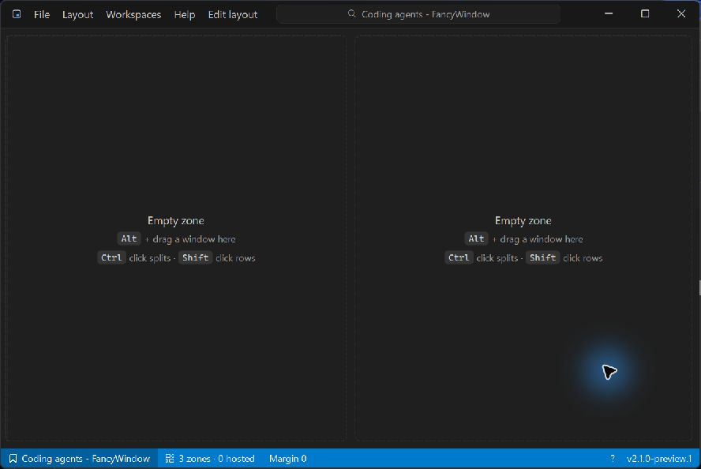
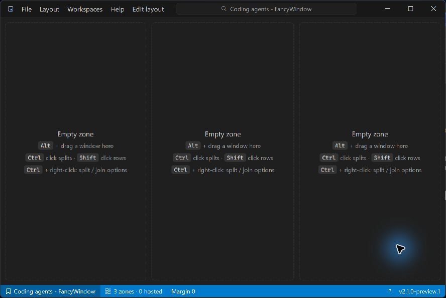

# Layout Add regression — 2 October 2026

Tested a fix on top of main `776c4ed`, **2.1.0-preview.1**, with Computer Use on
Windows 11. This pass also adds the empty-pane Ctrl + right-click menu hint.

## Reproduction and cause

1. Apply **Two side-by-side**.
2. Open **Edit layout**, select the left pane and press **H**.
3. Press **J**, choose **Join down**, and finish with **Enter**.
4. Choose **Layout > Add > Column left**.

Before the fix, the status bar counted three zones, but only two columns were
visible. Joins rebuild layout weights from physical extents. Add used weight 1
beside those much larger weights, leaving the added column almost invisible.
The regression test measured **0.99875 pixels instead of 266.66667 pixels** in an
800-pixel-wide layout. Saving and reloading the joined layout retains the bug.

## Fix and verification

A new outer sibling now gets the average existing sibling weight. This gives it
usable space while preserving the relative sizes and identities of existing panes.
Wrapping a layout with the other orientation continues to divide the space evenly.

The exact UI sequence above now produces three visible equal-width columns.
Live menu checks also passed for **Column right**, **Row above** and **Row below**;
the layout gained one usable pane for each action, retaining its existing panes.
The empty panes show **Ctrl + right-click: split / join options**, with the Ctrl key
drawn as a keycap. Hints are hidden when the pane is too small to fit the text.

- `cargo test --locked`: **220 passed**, zero failures.
- `cargo build --release --locked`: passed.
- The new model regression covers left/right columns and above/below rows after a
  join and a JSON save/reload round trip.
- The app regression verifies that adding a column keeps both hosted-window
  associations, requests their new positions and releases neither window.
- Live verification used empty panes. Native terminal hosting, manual Alt+drag
  and default Windows-key focus shortcuts are not signed off by this pass.

The images are unaltered captures of the running application, converted from
JPEG to PNG at **888 × 594**. The before image uses the `e8422c4` application build
(unchanged by the documentation-only `776c4ed` commit); the after
image uses this fix. They are not the pending four-terminal README headline image.
